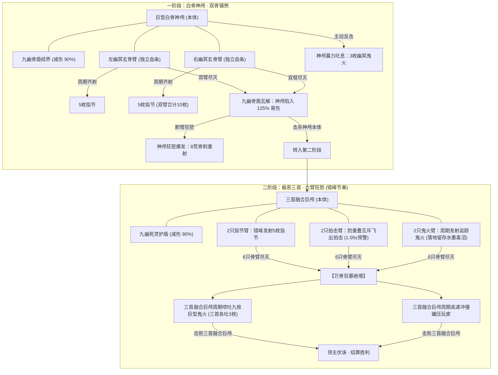

# 领主全面重绘：【幽冥白骨尸皇】国风水墨写实玄幻重塑方案

> **风格演进**：彻底摒弃此前过于简化的矢量卡通风格，**完全对齐第一领主「千年赤炼蛟」的纯正国风水墨修仙写实玄幻美术风格**。融入苍劲水墨飞白墨韵、历经万劫的斑驳象牙骨质裂纹、深邃眼窝中熊熊炽燃的九幽青碧魂火、道法符箓森然的残破冥冠与环绕周身的幽魂冥煞。

---

## 一、 全套重绘水墨序列帧与特效资产总览

| 资产文件名 | 物理尺寸 | 帧数 / 规格 | 国风水墨写实重绘细节 |
| :--- | :--- | :--- | :--- |
| `boss_corpse_skull_sheet.png` | 720×360 | 8帧 (4列×2行) | **一阶段主体**：苍劲巍峨的白骨神颅，配戴符箓黑金冥冠，深邃空洞眼眶喷涌青碧魂火，8帧呼吸浮沉与耀目光耀星芒 |
| `boss_corpse_tri_skull_sheet.png` | 720×360 | 8帧 (4列×2行) | **二阶段主体**：三首融合狂骨巨神，三具凶煞魔颅交错咬合，六道空洞鬼火同时怒燃，百鬼夜行般的水墨死气翻涌 |
| `boss_corpse_arm_sheet.png` | 720×360 | 8帧 (4列×2行) | **悬浮骷髅神臂**：多节段白骨臂骨，下接锋利森寒的五指勾魂利爪，指尖拖曳碧火流光，悬浮微幅摆动 |
| `effect_corpse_knuckle.png` | 256×256 | 高清透明单体 | **九幽指节弹幕**：尖锐破空的古朴指骨飞刺，环绕螺旋状水墨风煞与幽绿魂焰气旋 |
| `effect_corpse_ghost_fire.png` | 256×256 | 高清透明单体 | **追魂幽冥鬼火**：森绿魂火烈球，核心浮现狰狞哀嚎的百鬼面孔，四周墨韵翻腾，接近玩家引爆毒沼 |
| `effect_corpse_poison_pool.png` | 512×512 | 高清透明单体 | **幽冥死灵毒沼**：水墨写实俯视深坑，沸腾浓稠的幽绿酸蚀冥液、骷髅冤魂蒸气与黑色泼墨飞溅边缘 |

````carousel

<!-- slide -->

<!-- slide -->

<!-- slide -->

<!-- slide -->

<!-- slide -->

````

---

## 二、 核心战斗机制与节奏数值优化



### 1. 一阶段：幽冥神颅 · 双骨镇煞
- **分散多部位**：中央巨型白骨神颅，悬浮左、右两只巨型骷髅手臂；
- **独立血条与索敌机制**：神颅与双臂皆拥有独立血条。两只骨臂在战场独立注册为实体，武器与技能会**自动优先锁定存活的骨臂**；
- **九幽骨盾（减伤 90%）**：只要有任意一只骨臂存活，中央神颅享受**90% 巨量减伤**（受创浮现 `格挡90%` 字样与幽绿骨环护盾）；
- **破盾易伤（125% 受创）**：击破两只骨臂后，九幽骨盾崩解，神颅防御大幅下降，承受 **125% 易伤打击**；
- **骨臂弹幕调整**：每只骨臂发射 **5 枚指节弹幕**，双臂加在一起齐射**合计 10 枚**，扇形角度适中，走位躲避体验优良；
- **神颅主动反击机制**：
  - 避免断臂后神颅沦为活靶子，加入 `skullWindup` 蓄力前摇（神颅高频颤动、下颌凝聚幽绿魂火光效）；
  - **幽冥吐息**：向玩家方向喷吐 3 枚幽冥鬼火扇形弹；
  - **八荒骨刺**：断臂狂怒时，神颅口颌环向爆发 8 荒骨刺弹幕，与吐息交替轰击。

### 2. 二阶段：三首融合狂骨 · 六臂错峰平衡
- **形态蜕变**：击杀一阶段神颅后，触发蜕变，化身为**三首融合狂骨巨泰坦**；
- **手臂扩充为 6 只**，全面进行攻击间隔与防重叠平衡：
  1. **指节组（2 臂）**：初始冷却错峰拉开（3.2s 与 5.8s），单臂发射 5 枚指节，冷却由 4.0s 增至 6.0s~7.5s；
  2. **拍击组（2 臂）**：
     - **防重叠互斥机制**：同一时刻只允许一只骨臂执行拍击，另一臂自动延后 2.5s~3.5s，杜绝双臂同时下砸封死玩家走位；
     - **预警时间延长**：地面拍击阵法预警时间由 0.75s 延长至 **1.05s**，给玩家充足的辨识反应与轻功走位时间；
     - **冷却大幅放宽**：归位后冷却调整为 **7.5s ~ 9.5s**；
  3. **幽火组（2 臂）**：发射追踪型幽冥鬼火，飞行速度平缓化（145px/s），冷却调整为 **7.5s ~ 9.0s**；
- **幽冥毒沼视觉重塑**：
  - 鬼火接近玩家（<36px）或寿命耗尽后轰鸣引爆，在地面留下持续 **3.2 秒**的幽冥毒沼；
  - 彻底抛弃几何渐变色块，采用 512×512 国风水墨写实毒沼贴图，呈现内部沸腾的幽绿酸蚀灵液、升腾的骷髅蒸气与边缘水墨飞溅，并辅以自旋呼吸与平滑淡入淡出。

### 3. 狂暴绝境：三首暴走
- **绝境狂怒**：当玩家击破二阶段全部 6 只骨臂后，三首融合狂骨进入狂暴暴走状态；
- **幽冥吐息**：三首巨颅周期性连射 **9 枚大型幽冥鬼火**（左、中、右三具骷髅头各喷吐 3 枚，呈约 130 度扇面轰击）；
- **狂骨冲撞**：周期性发起高速直线冲撞，对路径上的玩家造成毁灭性接触碰撞伤害。

---

## 三、 验证与自动化测试保障

1. **测试套件**：[`tools/test_corpse_emperor.mjs`](file:///e:/CODE/game/tools/test_corpse_emperor.mjs)
2. **测试覆盖**：
   - 包含 **70 项细致断言**，涵盖 6 大贴图物理文件与 PNG 尺寸/头检验、部位独立血条、减伤与破盾易伤、单臂 5 枚与双臂 10 枚指节弹幕、一阶段神颅主动吐息与八荒骨刺、拍击防重叠、追踪鬼火与水墨毒沼、三首狂暴冲撞及结算清场；
   - 全项目 12 个测试套件持续保持 **100% 通过（12/12）**。
