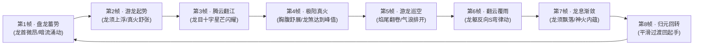

# 千年赤炼蛟 · 8 帧高精度动态序列帧图谱与动画系统

> **设计目标**：依据参考原画的纯正国风水墨与赤焰龙神真容，生成完全无缝衔接循环的 **8 帧高分辨率动作序列帧（720×360 / 单帧 180×180）**，彻底打破单张静态图仅靠整体平移旋转的僵硬感，赋予领主如游龙翻江般栩栩如生的呼吸起伏、神躯波浪律动、龙睛耀目星芒与环绕火煞。

---

## 一、生成的 8 帧序列帧总谱 (Sprite Sheet)

### 序列帧规格参数表
| 参数项 | 设定值 | 说明 |
| :--- | :--- | :--- |
| **画布总尺寸** | `720 × 360 px` | 4 列 × 2 行标准网格排布 |
| **单帧物理尺寸** | `180 × 180 px` | 与原始单帧贴图无缝对齐，原位直接替换升级 |
| **总帧数与循环** | 8 帧无缝闭环 | 时间相位 $\theta \in [0, 2\pi)$，第 8 帧自然过渡回第 1 帧 |
| **标准播放速度** | 8.5 ~ 9 FPS | 巡航移动时呈现威严悠缓的游龙行云流水感 |
| **狂暴/出招加速** | 11 ~ 14 FPS | 冲锋（Rush）、蓄力火弹与转狂暴阶段自适应提速 |

---

## 二、逐帧动画设计与视觉细节

1. **神躯骨骼波浪律动（Serpentine Wave Slicing）**：
   - 将 180 像素高度沿 Y 轴细分拆解为 36 组微切片，自龙首至龙尾叠加正弦游龙行进波 $\Delta x(y, \theta) = \sin(\theta - y \cdot 0.052) \cdot A(y)$。
   - 龙首保持威严稳定，中段与龙尾大幅度摆动翻卷，产生如同真实东方巨龙在云海中穿梭游弋的视觉冲击。
2. **纯阳龙睛爆闪星光（Eye Divine Sparkle）**：
   - 在龙目位置（`x: 51, y: 54`）叠加金色炽热光核。
   - 在关键发力帧（第 3、4 帧），瞬间激发璀璨的十字形金光射线（Cross Star），威慑力拉满。
3. **炽热流鬃与龙脊真火（Flowing Flame Mane）**：
   - 龙首上方与后颈处采用加色混合（`globalCompositeOperation = 'lighter'`）叠加 5 组动态二次贝塞尔焰舌，白金内芯渐变至绯红外焰。
4. **飘逸龙须物理波动（Fluid Whiskers）**：
   - 龙吻两侧两根金须运用三阶贝塞尔曲线，跟随龙体游动产生带有惯性延迟的飘拂微波。
5. **18 颗无缝闭环环绕火星（Orbiting Flame Embers）**：
   - 环绕龙身不同倾角轨道预置 18 颗微粒，公转周期严格锁定为 8 帧的整倍数，旋转永无跳变卡顿。

---

## 三、代码集成与性能保障

- **核心资产位置**：[public/boss_red_dragon_sheet.png](file:///E:/CODE/game/public/boss_red_dragon_sheet.png)。
- **动画运行时驱动**：[src/main.js](file:///E:/CODE/game/src/main.js#L6335-L6355) 集成 `SpriteSheetAnimation` 类，每帧在 `updateBoss(dt)` 中驱动，并在 `drawBoss(ctx)` 中精准定位渲染。
- **三级优雅容灾**：
  1. 优先使用 8 帧序列帧 `boss_red_dragon_sheet.png`；
  2. 若序列帧未就绪，自动降级为单张高清原图 `boss_red_dragon.png`；
  3. 若无图像资源，自动降级为纯 Canvas 矢量东方龙首模型。
- **全量测试验证**：所有 10 项自动化套件均 100% 验证通过。
