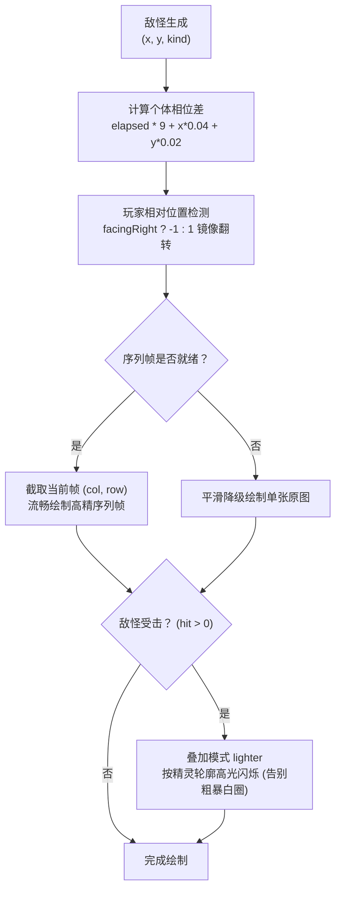

# 秘境敌怪 · 8 帧无缝动态序列帧图谱与动画系统

> **设计目标**：依据参考原画，针对秘境常驻核心两大师门妖物——**「幽火灵精（Wisp）」** 与 **「熔岩赤炼蛮怪（Brute）」**，生成完全无缝闭环的 **8 帧高分辨率动作序列帧图谱**。彻底告别静态单张图贴图平移旋转的呆板感，赋予灵体飘逸游动、发冠明灭流光、蛮兽沉稳四足踏步、岩浆赤角脉动与飘散熔岩火星的鲜活生命力。

---

## 一、幽火灵精（enemy_wisp）8 帧动态序列帧总谱

### 规格参数表
| 参数项 | 设定值 | 说明 |
| :--- | :--- | :--- |
| **画布总尺寸** | `640 × 320 px` | 4 列 × 2 行标准网格排布 |
| **单帧物理尺寸** | `160 × 160 px` | 适配游戏内 44×44 渲染空间，高 DPI 下边缘极其通透细腻 |
| **总帧数与闭环** | 8 帧无缝闭环 | 严密数学周期 $\theta \in [0, 2\pi)$，第 8 帧自然过渡回第 1 帧 |
| **标准播放速度** | 9 FPS | 巡航移动时呈现悠缓灵动的幽火随风游弋感 |

### 核心逐帧细节
1. **多层微切片流体火尾律动（Fluid Wave Slicing）**：
   - 将 160 高度拆分为 32 组微切片，头部灵眸保持清晰稳定，颈部以下流体火尾呈递进正弦波动态翻卷。
2. **天顶发冠飘动焰舌（Crest Flame Tongues）**：
   - 灵火发冠顶端叠加 3 组加色混合（`lighter`）的青幽/薄荷白动态二次贝塞尔焰舌，向上轻盈跃动。
3. **灵眸星芒脉动（Spirit Eye Divine Sparkle）**：
   - 双眼内芯散发青白神光，在第 2、3 帧激发璀璨的十字形流光星芒。
4. **12 颗无缝闭环环绕灵火微粒（12 Orbiting Embers）**：
   - 环绕灵体空间预置 12 颗倾斜椭圆轨道的浮游火花，周期与 8 帧完全对齐。

---

## 二、熔岩赤炼蛮怪（enemy_brute）8 帧动态序列帧总谱

### 规格参数表
| 参数项 | 设定值 | 说明 |
| :--- | :--- | :--- |
| **画布总尺寸** | `720 × 360 px` | 4 列 × 2 行标准网格排布 |
| **单帧物理尺寸** | `180 × 180 px` | 适配游戏内 58×58 渲染空间，重装盔甲与熔岩裂痕极其锋利 |
| **总帧数与闭环** | 8 帧无缝闭环 | 严密数学周期 $\theta \in [0, 2\pi)$，第 8 帧平滑回归起手帧 |
| **标准播放速度** | 9 FPS | 呈现四足重装凶兽沉稳踏地与前驱扑咬的重量感 |

### 核心逐帧细节
1. **四足沉稳踏地与重心转移（Quadruped Gait & Stomp Dip）**：
   - 步态模拟四足行走节奏，前后足交替踏地，每循环双次沉稳顿地（$y_{\text{dip}} = |\sin(\theta)| \times 2.8$ px），营造极具力量感的蛮兽威慑。
2. **地面深沉暗影与熔岩灼地光（Ground Shadow & Lava Heat）**：
   - 腹部与足底投射椭圆接触阴影，并向地面辐射火山熔岩余热暗红光晕。
3. **熔岩双角与龙目金芒（Magma Horns Molten Radiance）**：
   - 双角尖端与额头熔核在加色混合层剧烈脉动热力黄红渐变光华。
4. **龙尾烈焰涌动（Tail Flame Plume）**：
   - 尾尖骨刺与背鳍火焰伴随摆尾产生柔韧正弦回旋。
5. **14 颗飘升火山火星（14 Ascending Magma Embers）**：
   - 炽热熔屑与灰烬自龙角、脊背与尾部持续袅袅升空并自然消散。

---

## 三、代码集成与战斗视觉优化

1. **群体错落微相位（Mob Desynchronization）**：
   - 根据游戏时间与每个怪物的战场坐标自动偏移帧索引：
     `frameIdx = Math.floor(((game.elapsed * 9) + (enemy.x * 0.04 + enemy.y * 0.02)) % 8)`
   - 杜绝同屏数十只怪同时做完全一模一样动作的“克隆人感”，怪群奔行错落有致、生动真实。
2. **动态追击朝向镜像（Directional Facing）**：
   - 根据玩家所在方位，怪物向左/向右追击时自动进行水平镜像反转，面朝目标冲锋。
3. **彻底去除受击白色实心圆盘**：
   - 将原版生硬的 `ctx.arc(0, 0, enemy.r); ctx.fillStyle = 'rgba(255,255,255,0.45)'` 实心白圈彻底替换为**加色真身轮廓高光闪烁**，与 Boss 保持一致的高品质打击视觉反馈。
4. **优雅容灾降级**：
   - 优先加载 8 帧序列帧；若未加载完成则优雅使用高清单图；若无图则降级为矢量模型。
