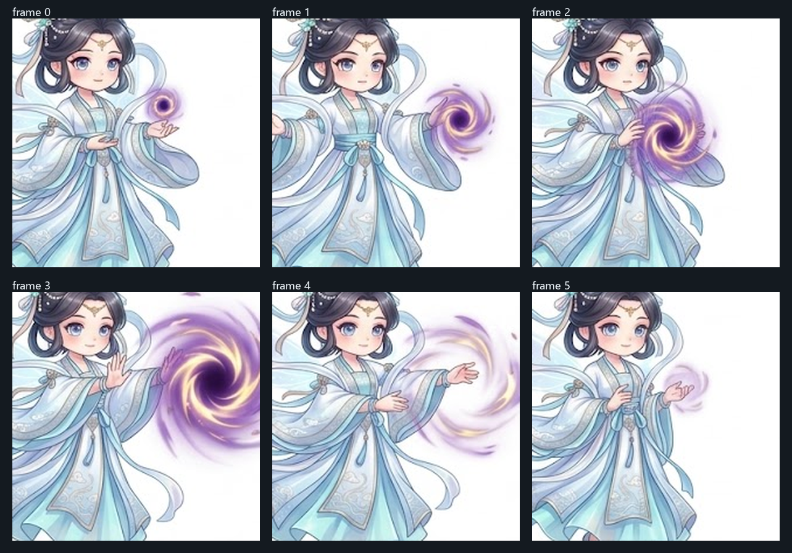
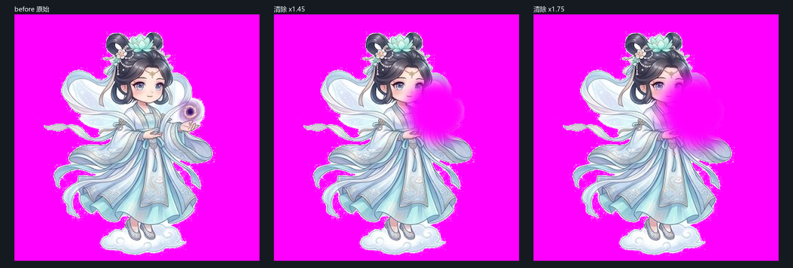

# 清虚仙子 · 三大本命神兵动作序列帧文稿

> [!IMPORTANT]
> **画风与角色形象必须 100% 对齐原版立绘**
>
> 请直接以原版 [`player_fairy.png`](../../public/player_fairy.png) 作为参考图像（Reference Image）进行同源衍生重绘：
>
> 1. **头身比例**：统一为经典 **3.5 头身 Q 版动漫仙侠体型**，与凌虚子系列保持同一比例，切勿拉长变样；
> 2. **容貌与发型**：复刻清虚仙子的**双丸子髻（双髻）**、髻间与髻上的**白色莲花发饰**、**眉心淡蓝花钿**、深墨蓝近黑的长发；
> 3. **道服细节**：**冷白与淡冰蓝的层叠交领广袖长袍**（外袍近白、内衬与下摆淡冰蓝），衣缘有浅蓝描边与银白纹样，身后有**数条银白与淡蓝的长飘带**向外飘展；
> 4. **足踏祥云**：她**始终悬浮**，每帧脚下保留一小朵白色祥云；
> 5. **画面中不得出现任何法宝（最关键的一条）**：序列帧里**只画角色本体 + 纯法术光效**，**八卦阵盘 / 拂尘 / 宝珠一个都不能画**。
>    原因是这三件法宝在游戏里由代码独立绘制、环绕于角色周身（见 `src/main.js` 的 `drawFloatingWeapons`）。
>    若序列帧里也画了法宝，战斗中就会**同时出现两个法宝**。
>    角色双手**完全空置**，以法修正统「**掐诀结印 · 以印驭器**」为主。
>    可对照现有剑修序列帧 [`player_sword_qingfeng_sheet.png`](../../public/player_sword_qingfeng_sheet.png) —— 他手中并没有剑，只有指尖的气劲光效；剑本体同样由代码单独绘制。
> 6. **配色纪律**（实测硬约束，见第四节）：整体**低饱和、高明度**，色相集中在 **192°–216°**，固有色饱和度 **≤ 25%**。

---

## 一、角色参考

| 用途 | 文件 |
| :--- | :--- |
| **形象与画风基准（必须对齐）** | [`public/player_fairy.png`](../../public/player_fairy.png) |
| 比例与帧规格对照（已完成，可参考） | [`public/player_sword_qingfeng_sheet.png`](../../public/player_sword_qingfeng_sheet.png) |
| ✅ 已产出：八卦阵盘序列帧 | [`public/player_spell_bagua_sheet.png`](../../public/player_spell_bagua_sheet.png) |
| ✅ 已产出：灵木拂尘序列帧 | [`public/player_spell_fuchen_sheet.png`](../../public/player_spell_fuchen_sheet.png) |
| ⬜ 待产出：混元宝珠序列帧 | `player_spell_baozhu_sheet.png` |

> 已产出的两套可作为后续出图的**同源参照**：形象、头身比、帧基线都已统一，
> 新的一套请与它们并排比对，确保三套之间角色形象完全一致。

---

## 二、动作帧与实装效果

游戏内 `attackTimer` 全程仅 **0.28 秒**，按下列时间轴切帧
（见 `src/main.js` 中 `useSheet` 分支）：

| 阶段 | 帧号 | 显示时长 | 说明 |
| :--- | ---: | ---: | :--- |
| — | **0** | 待机常驻 | 悬浮静立 |
| 起手 | **1** | ≈0.042s | 同时兼作**移动帧**（移动时 0/1 以 7Hz 交替） |
| 蓄劲 | **2** | ≈0.076s | |
| **巅峰** | **3** | **≈0.078s** | 伤害判定帧，**最关键的一帧** |
| 余韵 | **4** | ≈0.050s | |
| 收招 | **5** | ≈0.034s | |

> 每帧实际只闪现零点零几秒 —— **剪影可辨识度远比细节重要**，
> 六个帧的**外轮廓必须一眼能区分**。

> **表中"法宝"一列描述的是「法术表现」，不是要画出来的物件。**
> 三件法宝本体一律**不出现在画面里**（由程序单独绘制），
> 只画角色手印 + 对应的法术光效。

| 动作阶段 | 帧号 | 八卦阵盘（阵起绞杀） | 灵木拂尘（挥扫仙浪） | 混元宝珠（引力奇点） |
| :--- | :--- | :--- | :--- | :--- |
| **待机姿态** | Frame 0 | 双手拢于广袖之中，足踏祥云轻浮，飘带自垂 | 右手虚托于身侧，左袖微扬 | 双掌虚抱于胸前，掌间只有极淡紫雾 |
| **飘移起手** | Frame 1 | 侧身斜掠，右掌向地面一引，指尖垂落 | 沉肩展袖，右臂向外划开 | 身形前倾，双掌向两侧分开如揽月，指间带出气流 |
| **蓄劲引势** | Frame 2 | 双指并拢下点，掌心泛起淡蓝阵纹微光 | 广袖向后引蓄，袖口与飘带向后流动 | 双掌自外向内环抱，紫气收拢成旋涡 |
| **招式巅峰** | Frame 3 | 双掌猛然下压按地，脚下地面绽开金翠色八卦法阵并向外扩散 | 广袖横扫划出扇面弧光，身前炸开银白至冰蓝的仙浪扇面 | 双掌向前推出，身前炸开紫气旋涡并向外扩张回卷 |
| **破空余韵** | Frame 4 | 掌势下沉未尽，指间蓝光涟漪向四方扩散 | 袖摆回旋带出残风，扇面余光向后曳尾 | 推出之势未收，紫气向外扩散回卷成丝 |
| **敛息收招** | Frame 5 | 收掌拢袖，地面阵纹余光缓缓消散 | 收袖归位，衣带悠然垂落回位 | 双掌合拢收回胸前，紫雾缓缓消散 |

> **移动表现**：她**踏云飘移**而非步行。Frame 1 兼作移动帧，
> 因此该帧需同时成立为"疾掠起手"与"飘移行进"两种读法 —— 上身保持稳定、仅衣带与飘带向后流动。

---

## 三、技术规格（务必严格遵守）

| 项目 | 要求 |
| :--- | :--- |
| 单张成品尺寸 | **540 × 360**（3 列 × 2 行，**单帧 180 × 180**，共 6 帧） |
| 建议出图尺寸 | 按 **2 倍**出图（即 1080 × 720，单帧 360 × 360）后降采样，边缘更干净 |
| 帧序 | 行优先：左上→右上→中左→中右→下左→下右 = 帧 0 → 帧 5 |
| 格式 | PNG，**必须带 alpha 透明通道**，纯白或纯色背景均可（我会连通域抠底） |
| **脚底基线** | **角色本体脚底（祥云底部）落在单帧高度的 93% 处**（180px 帧即 y ≈ 167）。此为实测现有剑修序列帧得出，务必一致 |
| 特效范围 | **法术特效可向下、向外扩展，不受基线限制**。参考剑修实测：帧 3 / 帧 4 的内容包围盒底边会低至 **86.7%–90%**（地面特效向下铺开）。判定基线时**只看角色本体，不看特效包围盒** |
| 头顶留白 | 内容上缘约在单帧高度的 **7%** 处（y ≈ 13），即角色本体约占单帧高度 **86%** |
| 水平位置 | **居中**，左右留白对称（角色本体宽度约 100–140 px） |
| 特效横向余量 | 帧 3 / 帧 4 的法术特效可横向扩展至接近满宽（x 13–167），但**角色本体尺寸不得变化**，只有手印、飘带与法术特效变化 |
| 朝向 | **一律朝右**（游戏会按移动方向水平镜像翻转） |
| 网格内垂直一致性 | 六帧的角色**必须在各自格子里处于同一垂直位置**。实测 AI 出图常出现"整行偏移"（v2 的上排头顶在 y≈26、下排却在 y≈12，相差 14px）。若无法保证，我会用 `tools/art/align_frames.py` 按头顶锚定做后期对齐，不必重出 |

### 构图模板（可作为叠图参考一并上传）


模板为 2 倍尺寸（1080×720，单帧 360×360），已标出每格的**头顶线（7%）**与**脚底基线（93%）**。
出图时可把它作为构图叠图，或至少在生成后按此线位检查。

---

## 四、配色纪律（实测数据）

对 `player_fairy.png` 实体像素做 k-means 取色，清虚仙子的色彩构成：

| 色值 | 占比 | 色相 | 饱和度 | 明度 |
| :--- | ---: | ---: | ---: | ---: |
| `#CFE6F0` | 24.5% | 197° | 13% | 94% |
| `#F1F5F6` | 21.0% | 192° | 1% | 96% |
| `#B0D0E2` | 19.4% | 200° | 21% | 88% |
| `#95B0C6` | 13.8% | 206° | 24% | 77% |
| `#7B889D` | 8.2% | 216° | 21% | 61% |
| `#514F62` | 6.3% | 245° | 19% | 38%（发色） |
| `#D1C0BE` | 6.9% | 5° | 9% | 81%（肤色） |

**三条硬约束**：

1. **低饱和**：除肤色与发色外，**器物与衣物固有色饱和度 ≤ 25%**。实测角色上限为 **23.4%**，超出的颜色会立刻显得"脏"、出戏。（辉光/法术光效属加色元素，不受此限。）
2. **高明度**：主体明度 **≥ 77%**，整体 high-key 仙气调子。
3. **冷色相集中**：**192°–216°**（青→蓝）区间，属相邻类似色。

三件法宝各自的点缀色（均已在游戏内实装，序列帧需与之统一）：

| 法宝 | 主色 | 点缀 |
| :--- | :--- | :--- |
| 八卦阵盘 | 金 + 翠玉 `#EED57D` | 太极阴阳 |
| **灵木拂尘** | 青玉 `#A9C6B8` + 银白 `#E8EEF2` | 冰蓝灵晶 `#CFE6F0` |
| 混元宝珠 | 紫金 `#D6A8F8` | 引力奇点 |

---

## 五、负面约束（务必避免）

- ❌ **画出任何法宝**（八卦阵盘 / 拂尘 / 宝珠）—— 这是最容易犯的错。法宝由程序单独绘制，
  画进序列帧会导致战斗中**同时出现两个法宝**。画面里只应有角色本体与纯法术光效
- ❌ 头身比例拉长（必须 3.5 头身）
- ❌ 高饱和青绿 / 荧光色 / 大红大紫等与角色冲突的颜色
- ❌ 写实画风、厚涂油画质感、3D 渲染感
- ❌ 地面、影子、场景、背景元素（**她是悬浮的，不要落地阴影**）
- ❌ 文字、印章、水印、边框、格线
- ❌ 六帧之间角色形象/比例/服装发生漂移（必须完全一致，只变手势与动态）
- ❌ 帧与帧之间的站位、脚底高度不一致（会导致实装时角色抖动）

---

## 六、可直接投喂的提示词

> **三张序列帧请分三次生成**，每次都上传 `public/player_fairy.png` 作为风格参考图。
> 先贴【通用风格基线】，再贴对应的【法宝动作】段落。

### 通用风格基线（三次都要带）

```
绘制仙侠游戏角色的 6 帧动作序列帧集，3 列 × 2 行网格，每格 180×180，输出 1080×720，
PNG 带透明通道（或纯白背景）。角色行列顺序：左上→右上→中左→中右→下左→下右 = 帧0~帧5。

【角色形象 —— 严格对齐参考图中的「清虚仙子」，六帧必须完全一致】
- 3.5 头身 Q 版动漫仙侠体型，圆润可爱，切勿拉长比例
- 深墨蓝近黑长发，梳成左右两个丸子髻（双髻）；髻间与髻上缀白色莲花发饰；眉心一枚淡蓝花钿
- 冷白与淡冰蓝的层叠交领广袖长袍：外袍近纯白，内衬与下摆淡冰蓝，衣缘有浅蓝描边与银白纹样
- 身后数条银白与淡蓝的长飘带向外飘展
- 肤色暖白，大眼睛
- 她始终悬浮，每帧脚下保留一小朵白色祥云

【配色纪律】
- 整体低饱和、高明度，冰蓝银白的仙气调子；色相集中在 192°–216°
- 主色：淡冰蓝 #CFE6F0、冷白 #F1F5F6、天青 #B0D0E2、灰蓝 #95B0C6；发色 #514F62
- 除肤色与发色外，所有固有色饱和度不超过 25%，杜绝高饱和与荧光色

【最关键约束 —— 不要画法宝】
- 画面里只画角色本体和纯法术光效，绝对不要画任何法宝
- 不要把八卦阵盘、拂尘、宝珠画进去，无论悬浮在身侧、前方还是手中都不行
- 这三件法宝在游戏中由程序单独绘制并环绕角色，画进来会导致战斗中同时出现两个法宝
- 角色双手完全空置，只做掐诀结印的手势
- 可参考同项目的剑修序列帧：他手中同样没有剑，只有指尖的气劲光效
- 六帧的角色大小、位置、服装完全一致，只有手势、飘带与法术特效变化
- 角色本体居中，脚底（祥云底部）统一落在每格高度 93% 的位置，头顶约在 7% 处
  （若按 1080×720 出图，每格 360×360，即脚底在 y≈335、头顶在 y≈25；请严格对齐，不要贴到格子底边）
- 六帧的脚底高度必须完全一致，不要有的高有的低
- 色彩上整体偏明亮通透：这是仙侠题材的仙气调子，不要厚重、不要暗沉
- 角色一律朝右
- 不要地面、不要落地阴影、不要场景、不要文字、不要边框
```

### 其一 · 八卦阵盘（`spell_bagua`）

```
【本套动作 —— 八卦阵盘 · 阵起绞杀】
注意：不要画出八卦阵盘本身！它由程序单独绘制。这里只需画角色的手印与地面法阵光效。

帧0 待机：双手拢于广袖之中，足踏祥云轻浮，飘带自然下垂。
帧1 飘移起手：侧身斜掠，右掌向地面一引，指尖垂落。
帧2 蓄劲：双指并拢向下点出，掌心泛起淡蓝色阵纹微光。
帧3 巅峰：双掌猛然下压按地，脚下地面绽开金翠色八卦法阵光纹并向外扩散（这一帧最关键、最有张力）。
帧4 余韵：掌势下沉未尽，指间蓝光涟漪向四方扩散。
帧5 收招：收掌拢袖，地面阵纹余光缓缓消散。
```

### 其二 · 灵木拂尘（`spell_fuchen`）

```
【本套动作 —— 灵木拂尘 · 挥扫碧霞仙浪】
注意：不要画出拂尘本身！它由程序单独绘制（青玉柄、银白束环、冰蓝灵晶、银白拂丝）。
这里只需画角色的手印、广袖动势与银白至冰蓝的扇面光效。

帧0 待机：右手虚托于身侧，左袖微扬。
帧1 飘移起手：沉肩展袖，右臂向外划开。
帧2 蓄劲：广袖向后引蓄，袖口与飘带向后流动。
帧3 巅峰：广袖横扫划出一道扇形弧光，身前炸开银白至冰蓝的碧霞仙浪扇面（这一帧最关键）。
帧4 余韵：袖摆回旋带出残风，扇面余光向后曳尾。
帧5 收招：收袖归位，衣带悠然垂落回位。
```

### 其三 · 混元宝珠（`spell_baozhu`）

```
【本套动作 —— 混元宝珠 · 引力奇点】
注意：画面中绝对不要出现任何球体！不要画宝珠、珠子、圆球、暗色圆核、黑洞、星球。
"引力奇点"请只表现为「向外扩散的紫色气流旋涡」—— 流动的雾状气流与飞散的光丝，
不要有实心的球，也不要有暗色的圆心。画面里只有角色本体、手印与气流。

帧0 待机：双掌虚抱于胸前，掌间只有极淡的紫色雾气，绝对不要出现球体。
帧1 飘移起手：身形前倾，双掌向两侧分开如揽月，指间带出几缕紫色气流。
帧2 蓄劲：双掌自外向内环抱，紫色气流被收拢成旋涡状。
帧3 巅峰：双掌向前推出，身前炸开一圈向外扩张回卷的紫色旋涡气流（无实心球、无暗核，这一帧最关键）。
帧4 余韵：推出之势未收，紫色气流向外扩散并回卷成丝。
帧5 收招：双掌合拢收回胸前，紫色雾气缓缓消散。
```

---

## 七、验收标准

出图后我按以下清单逐条核验（脚本 + 目视）：

1. **规格**：成品 540×360，3 列 × 2 行，单帧 180×180，PNG 带 alpha
2. **基线一致**：六帧的**角色本体脚底**均落在单帧高度 **93% ± 2%**（判定时只看角色本体，排除法术特效）。带地面特效的帧内容包围盒可低至约 87%，属正常 —— 参考剑修帧 3/4 实测即为 86.7%–90%
3. **形象一致**：六帧之间角色高度差异 ≤ 3%，服装与发型无漂移
4. **配色合规**：固有色饱和度中位 ≤ 20%、均值 ≤ 20%，与立绘同区间
5. **剪影可辨识**：缩到 72×72（实装绘制尺寸）时，六帧外轮廓仍可区分
6. **无穿帮（一票否决）**：**六帧中均不得出现任何法宝**（阵盘 / 拂尘 / 宝珠），
   无论悬浮在身侧、前方还是手中。出现即为不合格，必须重出 —— 否则战斗中会同时显示两个法宝。
   参考剑修序列帧：他手中没有剑，只有指尖气劲光效
7. **抠底干净**：白底可被连通域抠图完整去除，飘带与拂丝间不残留白边

---

## 八、落地到游戏需要改的代码

现有序列帧系统**硬编码只服务剑修**，法修要接上需改三处（我来改）：

| 位置 | 现状 | 需改为 |
| :--- | :--- | :--- |
| `getPlayerWeaponSheet()` | `if (charId !== 'sword') return null` | ✅ **已改**：先按武器 id/type 查表，未命中时仅剑修回退默认帧，其余职业返回 null |
| `drawPlayerModel()` 内 | `charId === 'sword' && ...` | ✅ **已改**：去掉职业门控，改由 `getPlayerWeaponSheet` 返回 null 自然回退 |
| `playerWeaponSheets` | 只有 3 套剑修帧 | ✅ 已加 `spell_bagua`（含 `bagua` 类型别名）；拂尘 / 宝珠待出图后追加 |

配套还需要：

- `tools/test_player_weapon_sheets.mjs` 原断言 **「法修等其他非剑修职业返回 null」** ——
  ✅ **已改写**为「未登记帧集的武器返回 null」，并新增八卦阵盘的尺寸/帧数/匹配断言（该套件 40 → 51 项）

> 单帧绘制尺寸：游戏内以 `drawImage(img, sx, sy, 180, 180, -36, -59.04, 72, 72)` 绘制，
> 即 **72×72 逻辑像素**（高 DPR 下约 144–180 设备像素）。
> 因此 180×180 的单帧是充足的，不必更大。

---

## 附：与剑修文稿的对应关系

本稿结构对齐 [`lingxuzi_weapon_action_sheets.md`](lingxuzi_weapon_action_sheets.md)，
两者共用同一套帧语义与规格，差别仅在角色形象与动作母题：

| | 凌虚子（剑修） | 清虚仙子（法修） |
| :--- | :--- | :--- |
| 驭器方式 | 两指成剑 · 掐诀驭器 | 掐诀结印 · 以印驭器 |
| 移动表现 | 疾步踏出（步行） | 踏云飘移（悬浮） |
| 动作母题 | 剑指、贯日、力劈 | 手印、下压、环抱、推出 |
| 头身比 | 3.5 头身 | 3.5 头身（一致） |
| 帧规格 | 540×360 / 180×180 / 6 帧 | 同（一致） |

---

## 附二：v1 试出记录（八卦阵盘套，未采用）

原始出图存于 [`art-source/raw/qingxu_sheet_bagua_v1.png`](../raw/qingxu_sheet_bagua_v1.png)。
形象与画风方向正确，但有 **3 处必须修正**，其中第 1 条为一票否决：


左：原版立绘（形象基准）　中：v1 序列帧 帧0（可见右侧多出的八卦盘）　右：参照剑修 帧0（手中无剑）

| # | 问题 | 实测 | 结论 |
| ---: | :--- | :--- | :--- |
| 1 | **把八卦阵盘画进了序列帧** | 六帧右下侧均绘有绿色太极八卦盘 | ❌ **必须重出**。法宝在游戏内由 `drawFloatingWeapons` 单独绘制，会**同时出现两个法宝** |
| 2 | **脚底基线偏低** | 六帧内容底边落在 **97.1% / 97.1% / 97.4% / 100% / 98.0% / 97.1%**，目标为 **93%** | ❌ 需重出。实装后角色会比剑修低约 5 逻辑像素（约 7%），且帧 3 的地面法阵顶到帧底被裁切 |
| 3 | 整体略显瘦高 | 与立绘、剑修序列帧并排目视可见（立绘约 3.5 头身） | ⚠️ 建议一并校正，但无可靠自动量化手段，以目视为准 |

**第 1 条的成因**：本稿 v1 版措辞为「法宝独立悬浮于身侧或前方，绝不握在手中」——
这句话可被读成"把法宝画成悬浮在身侧"，属于**文稿歧义**，已在 v2 改为
「画面中不得出现任何法宝」并补充了剑修序列帧作为正面参照。

**第 2 条的成因**：v1 只写了"约 93%"而未给出像素行号。v2 已补为
「若按 1080×720 出图，每格 360×360，即脚底在 y≈335、头顶在 y≈25」。

> 另一处（非缺陷）：出图实际为 1024×687，并非 1080×720。
> 但 1024/687 = 1.4905，与 3:2（1.4909）几乎一致，单帧 341×343 近似正方，
> 因此**可正常降采样到 540×360，无需重出**。仅记录备查。

---

## 附三：v1 试出记录（混元宝珠套，未采用）

原始出图存于 [`art-source/raw/qingxu_sheet_baozhu_v1.png`](../raw/qingxu_sheet_baozhu_v1.png)。



**结论：仅「帧 0」不合格，其余五帧可用。**

| 帧 | 紫色元素形态 | 判定 |
| ---: | :--- | :--- |
| **0** | 掌上一颗**实心珠**：暗色圆核 + 粉紫圆环 | ❌ **与代码绘制的宝珠重复** |
| 1 | 紫色/金色**旋涡气流** | ✅ 属奇点特效 |
| 2 | 较大的旋涡气流（覆盖手臂） | ✅ 属奇点特效 |
| 3 | 大型紫金旋涡 | ✅ 属奇点特效 |
| 4 | 金紫**流丝** | ✅ 属奇点特效 |
| 5 | 弥散紫色**雾气**（无硬边、无暗核） | ✅ 属奇点特效 |

帧 0 是**待机帧**、常驻显示，因此这一处必须解决。

### 为什么不做后期清除

试过：按紫色阈值定位该珠并做圆形羽化清除。**失败** —— 珠子紧邻她的脸颊，
清除半径会削掉她的脸（见下图）。故只能重出。



### 成因与修正

两处措辞同时诱导了"画一颗珠子"：

1. 提示词里把特效称作**「引力奇点光晕」** —— "奇点"使模型画出了**暗核**（黑洞感），
   而暗核 + 圆环正是"珠子"的形态；
2. **第二节的帧表**里写了"宝珠悬于两掌之间""宝珠炸开为引力奇点" ——
   该表虽是设计描述，但同样是规格的一部分，属于措辞歧义。

v2 已同时修正：提示词改为「**绝对不要出现任何球体**……只表现为向外扩散的
紫色气流旋涡，不要有实心的球，也不要有暗色的圆心」，并在帧表上方加注
「表中法宝一列描述的是**法术表现**，不是要画出来的物件」。
