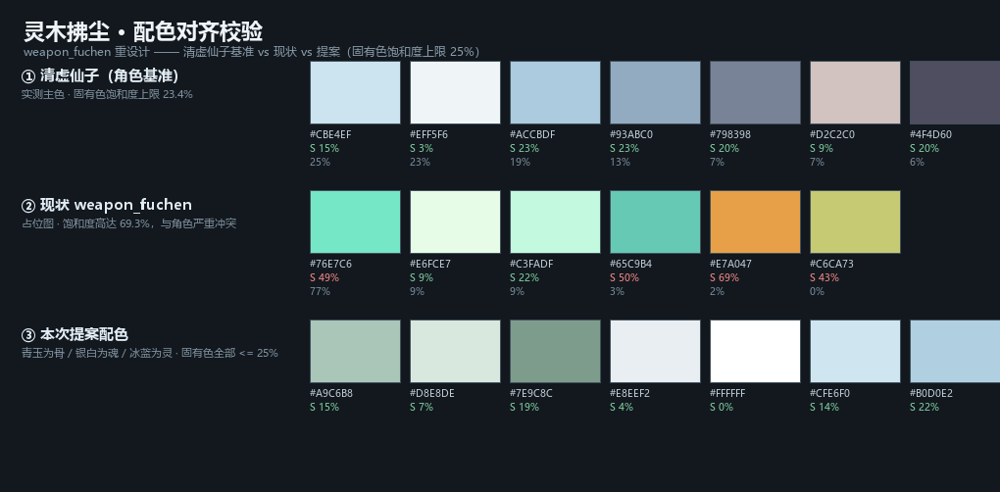
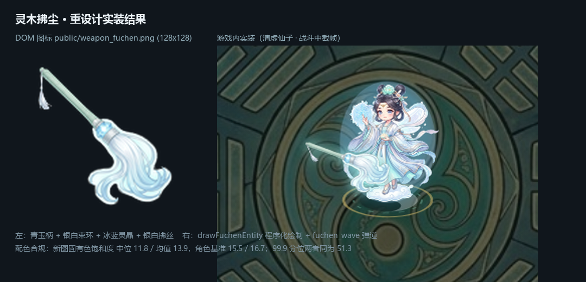

# 灵木拂尘 · 重设计文稿（对齐清虚仙子）

> [!IMPORTANT]
> **目标**：重做 `public/weapon_fuchen.png`，使它与角色 **清虚仙子（法修 · 太虚灵阁）** 的视觉语言完全匹配。
>
> 现状问题：现有图标 `weapon_fuchen.png`（128×128，仅 6.8 KB）是**早期占位图**——
> 一根高饱和青绿斜棍 + 一枚黄色圆点 + 一大片半透明薄荷绿圆形，
> 与游戏内其余武器图标（`weapon_bagua.png` 金玉阵法盘、`weapon_baozhu.png` 紫金混元珠）
> 的精致度差距极大，且配色与清虚仙子的冰蓝银白体系**完全冲突**。

---

## 一、角色风格基准（从 `player_fairy.png` 实测提取）

对 `public/player_fairy.png` 的实体像素做 k-means 取色，清虚仙子的色彩构成如下：

| 色值 | 占比 | 色相 | 饱和度 | 明度 | 用途 |
| :--- | ---: | ---: | ---: | ---: | :--- |
| `#CFE6F0` | 24.5% | 197° | 13% | 94% | 主色·淡冰蓝外袍 |
| `#F1F5F6` | 21.0% | 192° | 1% | 96% | 冷白·内衬与高光 |
| `#B0D0E2` | 19.4% | 200° | 21% | 88% | 天青·衣褶中间调 |
| `#95B0C6` | 13.8% | 206° | 24% | 77% | 灰蓝·暗部 |
| `#7B889D` | 8.2% | 216° | 21% | 61% | 深灰蓝·最暗褶皱 |
| `#D1C0BE` | 6.9% | 5° | 9% | 81% | 暖肤（仅面部/手） |
| `#514F62` | 6.3% | 245° | 19% | 38% | 墨蓝紫·发色 |

**三条硬性规律**（设计时必须遵守）：

1. **低饱和**：除肤色与发色外，全部**器物固有色**的饱和度 **≤ 25%**。任何高饱和色都会显得"脏"、出戏。
   （唯一的例外是**辉光/发光**——光是加色效果，本就比固有色更饱和，不参与固有色判定。）
2. **高明度**：主体明度 **≥ 77%**，整体是 high-key 的仙气调子。
3. **冷色相集中**：色相锁定在 **192°–216°**（青→蓝）区间，属于相邻的类似色。

> 实测对照：角色固有色饱和度上限 **23.4%**；
> 现有占位图 `weapon_fuchen.png` 高达 **69.3%** —— 这就是它看起来格格不入的根本原因。



上图三行分别为：① 清虚仙子实测主色 ② 现状 `weapon_fuchen.png` ③ 本次提案配色。
提案固有色饱和度上限 **22.1%**，落在角色基准（23.4%）之内。

**标志性元素**（可作为武器上的呼应母题）：
- 头顶**白色莲花**发饰 → 呼应为拂尘顶端的莲纹
- 手持**冰蓝灵晶**、身后悬浮**冰蓝法阵** → 呼应为拂尘的灵枢宝珠
- 脚踏**白莲云** → 呼应为云纹雕饰
- 垂坠的**银白飘带** → 呼应为拂尘的银白拂丝

---

## 二、设计推导：调和「灵木」与「清虚」

这里有一处必须正面解决的矛盾：

- 武器名 **灵木拂尘** 与设计手册里的攻击描述 **「挥扫荡开碧霞仙浪扇面」** 都指向**青绿**；
- 但角色整体是**冰蓝银白**，直接上饱和青绿会与角色割裂。

**解法：把「灵木」诠释为青瓷 / 淡青玉，而不是草木绿。**

即"灵木"是**玉化的仙木**（青玉、青瓷釉色）——保留木质器物的形制与"碧"的意象，
但把饱和度压到角色同一区间（≤ 25%）并提高明度。这样：

- 与角色并置时，青玉的微绿正好是冰蓝体系的**邻近色**，和谐不冲突；
- 仍然满足"灵木""碧霞"的命名与技能文案；
- 与 `weapon_bagua.png`（金+翠玉）区分开——**同门不同武器不能撞色**。

配色分工：**青玉为骨、银白为魂、冰蓝为灵**——绿只出现在手柄与雕纹，视觉主体仍是银白拂丝。

---

## 三、武器造型规格

### 1. 手柄（灵木 · 青玉）
- 材质：玉化灵木，半透青瓷质感，表面有**极淡的木质纤维纹理**与**云纹浅雕**
- 配色：中间调 `#A9C6B8`，受光面 `#D8E8DE`，暗部 `#7E9C8C`
- 直径收放：靠近束环略粗，握把处略细，末端收成圆头
- 尾端可缀一截**银白短绦**，与角色飘带呼应

### 2. 束环（银箍）
- 材质：哑光银 / 白玉，环身一周刻**云雷纹**
- 配色：`#E8EEF2` 主体，`#C3CFD8` 暗部
- 这是整把武器的**视觉重心与高光点**，需要最锐利的高光

### 3. 拂丝（银白拂尾）—— **画面主体**
- 形态：自束环向外**呈扇形放射**并自然下垂、末端微微内卷；分 3–5 股主束，股内再分细丝
- 配色：根部纯白 `#FFFFFF` → 中段 `#F1F5F6` → 末端渐入冰蓝 `#CFE6F0` / `#B0D0E2`
- 质感：**半透光、有丝绢的柔光边缘**，不是硬边塑料片；丝与丝之间要能透出背景
- 每根丝末端带极细的**冷白辉光**

### 4. 灵枢宝珠（束环上方嵌珠）
- 一颗**冰蓝灵晶**，多面切割，内部有白色核心辉光
- 配色：核心 `#FFFFFF` → 晶体 `#CFE6F0` → 外缘 `#B0D0E2`
- 与角色手中的冰蓝灵晶**同源同色**，是"这把武器属于她"的关键识别点

### 5. 莲纹雕饰
- 手柄与束环交接处，浮雕**一枚极简白莲**（呼应她头顶的莲花发饰）
- 不要写实花瓣，用**浅浮雕/线刻**处理，避免喧宾夺主

### 6. 整体辉光
- 外发光：`#96E8E0`（沿用游戏内已有的 `WEAPON_RENDER_PROPS.fuchen.glow`，见下）
- 辉光要**薄而通透**，包住拂丝外缘，不要糊成一团雾

---

## 四、技术规格

| 项目 | 要求 |
| :--- | :--- |
| 最终尺寸 | **128×128 px**（建议按 1024×1024 出图，我再降采样到 128） |
| 格式 | PNG，**必须带 alpha 透明通道** |
| 背景 | **纯白或纯色均可**（我用连通域抠底，白底最好）；**不要**棋盘格、不要渐变底、不要场景 |
| 构图 | 器物**居中**，占画面 **85–92%**，四周留均匀余白 |
| 朝向 | **斜向 45° 构图**（左上柄、右下拂尾），因为拂尘是细长器物，斜放才能在方框里占满 |
| 视角 | **正面微侧（约 15–20°）**，与 `weapon_bagua.png` / `weapon_baozhu.png` 的展示视角一致 |
| 打光 | 主光**左上**偏冷；轮廓光**右后**，用于描出拂丝的丝绢质感 |
| 细节密度 | 缩到 28–52 px 时**轮廓仍可辨认**——拂尘的辨识点是"柄 + 束环 + 扇形拂丝"三段式剪影 |

---

## 五、负面约束（务必避免）

- ❌ 高饱和青绿 / 荧光绿 / 草木绿手柄（现有占位图的最大问题）
- ❌ 大面积半透明色块（现有占位图的薄荷绿圆盘）
- ❌ 金色（金色已被 `weapon_bagua` 与 `weapon_baozhu` 占用，会撞门风）
- ❌ 紫色、红色等暖色或高饱和对比色
- ❌ 写实毛发质感（这是要能缩到 28 px 的游戏图标，不是插画）
- ❌ 人物、手、场景、背景装饰
- ❌ 文字、印章、水印、边框
- ❌ 立体投影/地面阴影（透明底游戏图标不应带投影）

---

## 六、可直接投喂的提示词

> 用 `public/player_fairy.png` 作为风格参考图（Reference Image）一并上传。

```
重绘一件仙侠游戏道具图标：灵木拂尘（道教拂尘 / 拂子）。

【风格基准——严格对齐参考图中的角色「清虚仙子」】
- 整体低饱和、高明度，冰蓝银白的仙气调子；色相集中在 192°–216°
- 主色：淡冰蓝 #CFE6F0、冷白 #F1F5F6、天青 #B0D0E2、灰蓝 #95B0C6
- 除肤色外全部颜色饱和度不超过 25%，杜绝高饱和与荧光色
- 质感通透、轻盈、有柔光边缘，仙气而非厚重

【器物结构，三段式剪影】
1. 手柄：玉化灵木，青瓷/淡青玉色（#A9C6B8，受光 #D8E8DE，暗部 #7E9C8C），
   表面有极淡木纹与浅雕云纹；尾端缀一截银白短绦
2. 束环：哑光银白玉箍（#E8EEF2），环身一周云雷纹浅刻，
   这是全图最锐利的高光点；束环上方嵌一颗多面冰蓝灵晶
   （核心纯白 #FFFFFF → 晶体 #CFE6F0 → 外缘 #B0D0E2），与角色手中的
   冰蓝灵晶同色，是识别点
3. 拂丝：银白扇形放射并自然下垂、末端微内卷，分 3–5 股主束；
   根部纯白 #FFFFFF 渐至末端冰蓝 #CFE6F0 / #B0D0E2；
   半透光丝绢质感，丝间可透背景，每根末端带极细冷白辉光
4. 手柄与束环交接处浮雕一枚极简白莲线刻，呼应角色头顶的白色莲花发饰

【构图与光】
- 斜向 45° 构图，左上为柄、右下为拂尾，器物居中占画面 85–92%
- 正面微侧约 15–20°，与游戏内其他道具图标视角一致
- 主光来自左上偏冷；右后方一道轮廓光勾勒拂丝
- 外缘一层薄而通透的青白辉光（#96E8E0），不要糊成雾团

【强制要求】
- 输出 1024×1024，PNG 带透明通道（或纯白背景，便于后期抠底）
- 不要人物、不要手、不要场景、不要文字、不要边框、不要地面投影
- 不要金色、不要紫色、不要高饱和绿色、不要写实毛发
```

---

## 七、验收标准

出图后按以下清单核对（我会用脚本 + 目视逐条验）：

1. **抠底干净**：白底可被连通域抠图完整去除，拂丝之间不残留白边
2. **饱和度合规**：**器物固有色**的平均饱和度 ≤ 25%，且无单点饱和度 > 35% 的固有色像素
   （灵晶核心与辉光属发光元素，不计入此项）
3. **色相合规**：主体色相落在 185°–220°；青玉手柄允许落在 140°–175°，但饱和度须 ≤ 25%
4. **缩略可辨识**：缩到 32×32 时，仍能看出"柄 / 束环 / 扇形拂丝"三段结构
5. **与同门区分**：与 `weapon_bagua.png`（金翠）、`weapon_baozhu.png`（紫金）并排时，配色不撞
6. **与角色并置和谐**：与 `player_fairy.png` 同屏时，明度与饱和度处于同一区间

---

---

## 八、实装结果（已完成）



左：`public/weapon_fuchen.png`（128×128）　右：游戏内实装截帧（清虚仙子 · 战斗中）

| 验收项 | 结果 |
| :--- | :--- |
| 抠底干净 | ✅ 连通域抠图，拂丝间无白边 |
| 饱和度合规 | ✅ 固有色中位 **11.8**、均值 **13.9**（角色基准 15.5 / 16.7）；99.9 分位两者同为 **51.3** |
| 色相合规 | ✅ 主体落在青→蓝区间 |
| 缩略可辨识 | ✅ 28 / 32 px 下"柄 / 束环 / 扇形拂丝"三段结构仍可辨 |
| 与同门区分 | ✅ 与 `weapon_bagua`（金翠）、`weapon_baozhu`（紫金）并置不撞色 |
| 与角色和谐 | ✅ 同屏明度与饱和度处于同一区间 |

### 实装过程中修正的两个问题

1. **抠图容差**：默认 `--tol-lo 10 --tol-hi 48` 会把拂丝核心（距白底约 38）压到约 74% 透明，
   拂丝几乎消失。本图背景是纯白（距离 ≈ 0），故收紧到 **4 / 14**。
2. **器物长度**：初版全长 41 单位，而法修单法宝由 `drawFloatingWeapons`
   以固定偏移 `(-20, -14)`、`scale=1` 绘制 —— 超过约 30 单位就会横贯角色身体，
   并把束环与灵晶挡在身后。已收紧到 **27 单位**，实装截帧确认手柄与灵晶清晰可见。

---

## 九、落地到游戏需要改的地方

重做图标只是第一步，`灵木拂尘` 在游戏里还有一处**程序化绘制**需要同步更新：

| 位置 | 现状 | 说明 |
| :--- | :--- | :--- |
| `public/weapon_fuchen.png` | 128×128 占位图，6.8 KB | ← **本次重设计目标**，文件名不变，无需改代码 |
| `src/main.js` `drawFuchenEntity()` | 仅 3 行，一个淡青叶片形 | 战场内飞行/环绕的拂尘本体，需按新设计同步重绘 |
| `WEAPON_RENDER_PROPS.fuchen` | `{ size: 44, glow: '#96E8E0' }` | 尺寸与外发光，可沿用或微调 |
| `fuchen_wave` 攻击特效 | 扇形碧霞仙浪 | 可考虑与新配色的青玉/银白统一 |

> 图标用于 DOM（卡片 28px / 拾取检视 52px / 装备槽 82%），
> 战场内实体是**代码绘制**、并不使用这张 PNG——两者需要各自更新以保持观感一致。

---

## 附：可选后续 —— 法修武器动作序列帧

目前只有剑修（凌虚子）拥有武器动作序列帧：
`player_sword_{qingfeng,jifeng,benlei}_sheet.png`（540×360，3列×2行，单帧 180×180，6 帧）。

**法修（清虚仙子）没有任何武器动作序列帧**。如果希望她也有同等表现，
需要为灵木拂尘再出一套 6 帧动作图（待机 / 移步 / 蓄势 / 挥扫 / 余韵 / 收招），
我可以另出一份分帧动作表文稿——参照
[`lingxuzi_weapon_action_sheets.md`](lingxuzi_weapon_action_sheets.md) 的格式。
