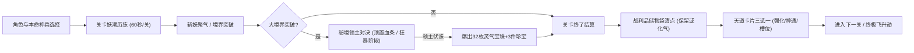
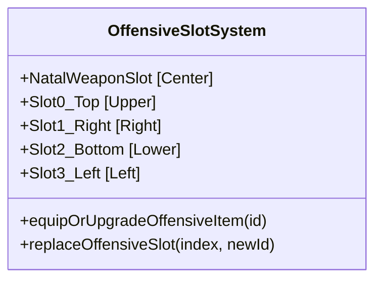
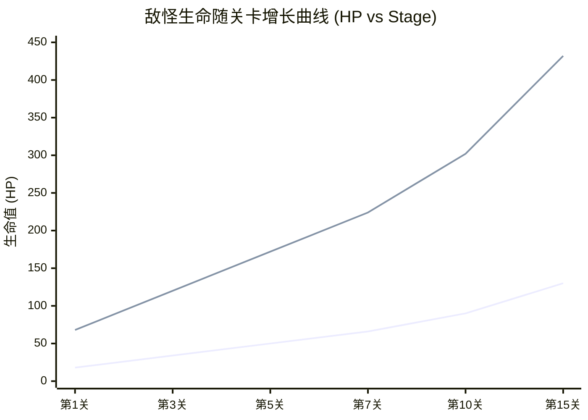

# 《仙途修真录》（Xianxia Roguelite）核心系统设计与数值平衡设定手册

> **文档版本**：v1.0.0 (System & Balance Reference Manual)  
> **适用工程**：`xianxia-roguelite`  
> **文档定位**：面向玩法策划、数值策划与核心程序开发者的全量设定手册。系统梳理游戏中全部角色、武器法宝、被动神通、机缘灵物、妖潮敌怪、境界领主及底层数值公式，便于后续版本迭代、平衡性调优与内容扩充。

---

## 目录
1. [游戏核心架构与战斗循环](#一游戏核心架构与战斗循环)
2. [角色道统与门派全设定 (8大角色)](#二角色道统与门派全设定)
3. [本命法宝与门派起手神兵 (24把法宝)](#三本命法宝与门派起手神兵)
4. [进攻法宝与灵宠 4 槽位系统](#四进攻法宝与灵宠-4-槽位系统)
5. [神通绝技与天道卡片库 (11张卡片)](#五神通绝技与天道卡片库)
6. [机缘灵物与掉落物品体系 (12件宝物)](#六机缘灵物与掉落物品体系)
7. [妖潮怪兽与生成数值曲线](#七妖潮怪兽与生成数值曲线)
8. [五大境界秘境领主 Boss 全矩阵](#八五大境界秘境领主-boss-全矩阵)
9. [修仙境界突破与底层数值公式体系](#九修仙境界突破与底层数值公式体系)
10. [后期开发数值调整速查与代码索引表](#十后期开发数值调整速查与代码索引表)

---

## 一、游戏核心架构与战斗循环

### 1.1 基础视听与画布规格
- **画布虚拟分辨率**：`960 × 540`（16:9 标准黄金视口）。
- **视口适配模式**：自适应窗口等比缩放（Letterbox 保持纵横比居中），根据设备像素比自动应用 `renderScale` 渲染管线。
- **目标帧率**：无锁 60 FPS（以 `requestAnimationFrame` 驱动，物理逻辑采用 `dt` 增量平滑积分）。
- **视效渲染技术**：HTML5 Canvas 2D 硬件加速，运用 `globalCompositeOperation = 'lighter'` 加色混合实现纯净发光，全面移除高开销的 `shadowBlur` 滤镜，确保多怪爆裂场景性能极度稳定。

### 1.2 核心单局玩法闭环

---

## 二、角色道统与门派全设定

游戏中拥有 **8 大不同修仙流派** 的道友角色，各自具备独特的气血底蕴、身法移速、神识感知、被动命格以及 3 把专属起手兵刃。

### 2.1 角色全属性数值矩阵表

| 角色名号 | 门派与道统 | 基础生命 | 基础移速 | 索敌神识 | 灵气拾取 | 专属被动命格机制 | 战术定位与核心打法 |
| :--- | :--- | :---: | :---: | :---: | :---: | :--- | :--- |
| **凌虚子** | 青冥剑宗 · 剑修 | 100 | 220 px/s | 140 px | 86 px | **剑气凌厉**：基础攻击力 $+25\%$ | 单点高爆发、中远距离御剑贯穿、走位风筝 |
| **清虚仙子** | 太虚灵阁 · 法修 | 100 | 220 px/s | 175 px | 121 px | **灵台清明**：神识范围 $+35$、拾取范围 $+35$ | 快速吸纳灵气、大范围持续控场、弱引力聚怪 |
| **铁狂徒** | 万象魔山 · 体修 | 150 | 235 px/s | 140 px | 86 px | **金刚不坏**：生命上限 $+50$、移速 $+15$ | 泰山压顶、重砸击退、超强肉身容错正面硬刚 |
| **白灵儿** | 万兽神谷 · 灵兽师 | 110 | 230 px/s | 150 px | 100 px | **万灵共鸣**：灵宠与随行伴生法宝伤害 $+30\%$，拾取 $+25$ | 灵兽飞扑、音波慑退、多重随行战力自动索敌 |
| **诸葛玄清** | 天机奇门宗 · 阵法师 | 95 | 215 px/s | 185 px | 135 px | **奇门遁甲**：阵法威力 $+35\%$、神识 $+30$ | 区域封锁、九宫重力泥潭、阴阳落子范围爆破 |
| **云舒** | 神农百草门 · 丹药师 | 120 | 220 px/s | 140 px | 110 px | **百草回阳**：丹药恢复效果 $+50\%$、生命 $+15$ | 持续治疗自愈、毒煞扇面灼烧、腐蚀毒沼池消耗 |
| **厉苍溟** | 修罗血狱道 · 魔修 | 130 | 230 px/s | 130 px | 75 px | **嗜血狂魔**：击败敌人 $20\%$ 汲取 $1$ 点血，基础伤害 $+15\%$ | 狂战士输出、低血量狂暴倍率、极速血月贯穿 |
| **幽月** | 酆都九幽 · 鬼修 | 85 | 240 px/s | 160 px | 115 px | **黄泉无相**：受击无敌延长 $50\%$、移速 $+10$ | 极致高移速走位、追踪鬼火、360°音煞击退护体 |

---

## 三、本命法宝与门派起手神兵

每位角色拥有 3 把特色神兵，进入历练前自由选择 1 把作为中心**本命法宝**。本命法宝享受角色初始被动与基础攻击加成。

### 3.1 24把本命法宝全参数规格

#### 1. 剑修 · 青冥剑宗
1. **青锋灵剑 (`sword_qingfeng`)**
   - **基础伤害**：28 | **攻击攻速**：1.3 次/秒 (间隔 0.78s) | **弹道速度**：370 px/s | **射程**：140 px
   - **攻击模式**：周身伴飞飞剑锁定敌人，高速直线贯穿，并在击中点爆裂青碧十字剑气。
2. **疾风残刃 (`sword_jifeng`)**
   - **基础伤害**：22 | **攻击攻速**：1.8 次/秒 (间隔 0.55s) | **弹道速度**：440 px/s | **回旋半径**：105 px
   - **攻击模式**：翡翠双刃周身极速 360 度圆环回旋，高频多段切割近身敌人。
3. **奔雷古剑 (`sword_benlei`)**
   - **剑体伤害**：26 | **落雷伤害**：16 | **攻击攻速**：1.1 次/秒 (间隔 0.95s) | **射程**：150 px
   - **攻击模式**：飞剑贯穿同时在敌人头顶引动九天神雷落雷轰顶，并向四周跳跃连锁紫电。

#### 2. 法修 · 太虚灵阁
4. **八卦阵盘 (`spell_bagua`)**
   - **阵眼伤害**：12 (多段绞杀) | **攻击频率**：0.9 次/秒 (间隔 1.10s) | **阵法半径**：110 px | **持续时间**：0.45s
   - **攻击模式**：敌群脚下凭空构筑太极八卦大阵，中心阵眼多段绞杀，外圈伤害递减。
5. **灵木拂尘 (`spell_fuchen`)**
   - **基础伤害**：12 | **附加属性**：生命上限 $+15$ | **攻击频率**：1.1 次/秒 (间隔 0.90s) | **扇形射程**：110 px / 60°
   - **攻击模式**：挥扫荡开碧霞仙浪扇面，轻微击退敌怪，近身强、远端弱。
6. **混元宝珠 (`spell_baozhu`)**
   - **基础伤害**：12 | **附加属性**：神识范围 $+20$ | **攻击频率**：0.9 次/秒 (间隔 1.15s) | **奇点半径**：120 px
   - **攻击模式**：祭出混元宝珠形成微弱引力奇点，多段绞杀并把散怪向中心牵引聚拢。

#### 3. 体修 · 万象魔山
7. **九疑重鼎 (`body_ding`)**
   - **基础伤害**：15 | **附加属性**：生命上限 $+30$ 并回满 | **攻击频率**：0.8 次/秒 (间隔 1.25s) | **震地半径**：110 px
   - **攻击模式**：巨鼎从天而降砸向地面，核心造成泰山压顶重创，外圈震波递减。
8. **龙鳞霸甲 (`body_armor`)**
   - **基础伤害**：14 | **附加属性**：生命上限 $+20$ | **攻击频率**：1.2 次/秒 (间隔 0.85s) | **冲拳距离**：115 px
   - **攻击模式**：身前轰出赤金狂暴真龙烈焰，拳心贯穿重伤，边缘掠击衰减。
9. **破军金锤 (`body_hammer`)**
   - **核心伤害**：16 | **攻击频率**：0.85 次/秒 (间隔 1.18s) | **裂地半径**：105 px | **击退系数**：极高
   - **攻击模式**：纯阳金锤重砸地面，爆发出裂地金光冲击波，震中重创，外围强力击退。

#### 4. 灵兽师 · 万兽神谷
10. **百兽金铃 (`beast_bell`)**
    - **基础伤害**：20 | **攻击攻速**：1.4 次/秒 (间隔 0.71s) | **音波范围**：135 px 扇面
    - **攻击模式**：摇动金铃激荡摄魂金色音波，附带音波击退与范围递减伤害。
11. **缚兽玄绫 (`beast_lash`)**
    - **基础伤害**：22 | **攻击攻速**：1.5 次/秒 (间隔 0.66s) | **扫荡弧度**：180° 半圆 (半径 120 px)
    - **攻击模式**：大弧长绫破空横扫，击退并多段打击身前所有围拢怪潮。
12. **唤灵法螺 (`beast_horn`)**
    - **基础伤害**：25 | **攻击攻速**：1.2 次/秒 (间隔 0.83s) | **袭杀射程**：220 px 直线
    - **攻击模式**：法螺长鸣，两只巡天金翅灵鹰虚影从两侧交错穿刺目标，完全贯穿沿途。

#### 5. 阵法师 · 天机奇门宗
13. **四象诛邪旗 (`formation_flag`)**
    - **单段伤害**：12 (每 0.22s 频发) | **攻击攻速**：0.9 次/秒 (间隔 1.10s) | **结界半径**：65 px (覆盖 130px)
    - **攻击模式**：目标区域投掷灵旗，青龙白虎朱雀玄武四象光索连线成阵，持续绞杀困敌 0.9 秒。
14. **天星弈棋 (`formation_chess`)**
    - **轰爆伤害**：26 | **攻击攻速**：1.1 次/秒 (间隔 0.91s) | **轰爆半径**：55 px 阴阳冲击波
    - **攻击模式**：黑白阴阳棋子自九天坠落相撞，引发毁灭性天元气爆（中心 1.0x / 外围 0.6x）。
15. **量天玉尺 (`formation_ruler`)**
    - **单段伤害**：10 (每 0.25s 频发) | **攻击攻速**：0.95 次/秒 (间隔 1.05s) | **禁绝范围**：90×90 px
    - **攻击模式**：玉尺横空划出九宫重力泥潭，目标区域陷入重泥泞减速与持续重压 0.85 秒。

#### 6. 丹药师 · 神农百草门
16. **紫金八卦炉 (`pill_furnace`)**
    - **基础伤害**：18 | **攻击攻速**：1.3 次/秒 (间隔 0.77s) | **喷射扇面**：75° 扇角 / 120 px 射程
    - **攻击模式**：炉盖开启喷涌三昧丹火扇面，持续灼烧前方妖群并附带药煞。
17. **碧玉药王杵 (`pill_pestle`)**
    - **基础伤害**：24 | **攻击攻速**：1.2 次/秒 (间隔 0.83s) | **震地半径**：55 px 冲击环
    - **攻击模式**：通灵神杵飞坠捣地，爆发翠浪药气碎骨震退，对中型头目极具压制力。
18. **千草腐仙葫 (`pill_poison`)**
    - **单池伤害**：11 (每 0.18s 频发) | **攻击攻速**：0.85 次/秒 (间隔 1.18s) | **覆盖范围**：3 处酸池 (半径 36 px)
    - **攻击模式**：抛射 3 颗剧毒丹丸，落地炸裂为腐蚀酸液池，存留 0.75 秒持续消融踏入怪。

#### 7. 魔修 · 修罗血狱道
19. **化血狂刀 (`demon_blade`)**
    - **基础伤害**：26 | **攻击攻速**：1.4 次/秒 (间隔 0.71s) | **飞行速度**：440 px/s 全贯穿
    - **攻击模式**：挥斩出猩红半月血煞刀芒，撕裂路径所有妖魔并附带击退。
20. **天魔血煞爪 (`demon_claws`)**
    - **基础伤害**：23 | **攻击攻速**：1.6 次/秒 (间隔 0.62s) | **攻击模式**：瞬发无弹道
    - **攻击模式**：无视空间在目标身上撕裂三道虚空血爪，暗劲瞬发爆裂，精准克制突进怪。
21. **修罗血皇玺 (`demon_seal`)**
    - **震世伤害**：27 | **攻击攻速**：0.9 次/秒 (间隔 1.10s) | **血浪半径**：65 px
    - **攻击模式**：血岳巨印悬空砸地，引发冲天血浪冲击波，附带全屏轻微震颤（中心 1.0x / 外围 0.65x）。

#### 8. 鬼修 · 酆都九幽
22. **幽冥引魂灯 (`ghost_lantern`)**
    - **单发伤害**：15 (双发并发) | **攻击攻速**：1.3 次/秒 (间隔 0.77s) | **弹道速度**：320 px/s
    - **攻击模式**：灯影晃动，祭出双朵碧磷幽火，具备敏锐自适应转向，自动追踪引爆。
23. **白骨哀丧棒 (`ghost_wand`)**
    - **基础伤害**：19 | **攻击攻速**：1.4 次/秒 (间隔 0.71s) | **退敌半径**：115 px 360° 全向
    - **攻击模式**：摇动哭丧棒发出凄厉音煞，全向强力震退推开身周一切包围妖怪。
24. **百鬼聚灵幡 (`ghost_banner`)**
    - **基础伤害**：22 | **攻击攻速**：1.2 次/秒 (间隔 0.83s) | **穿刺射程**：150 px
    - **攻击模式**：黑幡招展，百鬼化作高密度阴风螺旋锥强力突进穿刺敌群。

---

## 四、进攻法宝与灵宠 4 槽位系统

### 4.1 核心规则与机制
1. **槽位职能划分**：
   - **中心槽位**：锁定为玩家选择的唯一【本命法宝】。
   - **四周 4 槽位**（上、右、下、左）：用于存放历练中收集到的**独立进攻法宝、符箓与灵宠**（拥有独立进攻弹幕/AI/攻击计时器）。
   - **不占槽位机制**：单纯增加角色属性、被动效果（如「玄木灵体」、「御风行」、「逆脉诀」）以及主武器加成类神通（如「连锁电弧」、「离火焚原」）**直接作用于玩家身上，不占用武器槽位**。
2. **升阶强化机制**：
   - 收集到已拥有的同种进攻法宝/灵宠时，**对应槽位自动升 1 级（Lv.1 $\rightarrow$ Lv.2 $\rightarrow$ ...）**，伤害与机制阶梯式提升，槽位数量不增加。
3. **满额替换机制**：
   - 4 槽位全部占满后，再次获得新进攻法宝时触发**新旧替换窗口**（`modal-slot-replace`），道友可自由选择替换掉 4 槽位中的任意一个旧法宝，旧法宝属性完全剔除，新法宝置入并重置为 Lv.1。

### 4.2 4 大独立进攻装备进阶数值表

| 法宝/灵宠 ID | 对应名称 | 类型标签 | 基础属性 (Lv.1) | 升阶成长幅度 (每级提升) | 槽位描述模版 |
| :--- | :--- | :--- | :--- | :--- | :--- |
| **`fire`** | **赤炎葫芦** | 伴生法宝 | 每 2.2 秒锁定直线喷射纯阳三昧真火激光，基础加成攻击 $+5$ | 每级火线威力 $+40\%$（`firePower += 0.4`） | `灼热火线 · 威力 N% · 每 2.2 秒` |
| **`pet`** | **青羽灵狐** | 随行灵宠 | 每 4 秒抛物线飞扑一次，造成 55px 范围伤害 $42$ 点 | 每级扑击伤害 $+26$（`petDamage += 26`） | `扑击伤害 N · 每 4 秒` |
| **`formation`** | **回风阵** | 护体阵法 | 周身展开护体法阵，周期性击退并灼伤周围妖物 | 每级阵法威力 $+50\%$（`formationPower += 0.5`） | `护体罡风 · 威力 N%` |
| **`thunder`** | **昊天雷符** | 攻击符箓 | 每 3 秒引落一道九天神雷定点轰顶，基础伤害 $40$ 点 | 每级雷击伤害 $+20$（`thunderDamage += 20`） | `天雷轰顶 · 伤害 N · 每 3 秒` |

---

## 五、神通绝技与天道卡片库

每关历练结算时，天道恩赐提供三张卡片供玩家自由抉择。卡池覆盖武器强化、新得法宝、功法身法与超凡神通。

### 5.1 11张天道卡片全属性索引

| 卡片 ID | 卡片名号 | 归属类型 | 占用槽位 | 核心效果描述 | 进阶数值公式与成长阶梯 |
| :--- | :--- | :--- | :---: | :--- | :--- |
| **`sword`** | **流云飞剑** | 法宝 · 强化 | 否 | 飞剑伤害 $+12$，额外发射一柄飞剑 | 飞剑基础伤害递增，伴飞飞剑数量 $+1$ |
| **`fire`** | **赤炎葫芦** | 法宝 · 新得 | **是 (占槽位)** | 获得赤炎宝葫芦，每 2.2 秒喷射火线 | 初得置入槽位，已拥有则火线威力 $+40\%$ |
| **`formation`**| **回风阵** | 阵法 · 新得 | **是 (占槽位)** | 周身展开护体法阵，周期性击退群怪 | 初得置入槽位，已拥有则阵法威力 $+50\%$ |
| **`pet`** | **青羽灵狐** | 灵兽 · 新得 | **是 (占槽位)** | 召唤灵狐每 4 秒扑击敌怪产生范围 AoE | 初得置入槽位，已拥有则扑击伤害 $+26$ |
| **`thunder`** | **昊天雷符** | 符箓 · 新得 | **是 (占槽位)** | 每 3 秒引天雷轰击敌怪 | 初得置入槽位，已拥有则雷击伤害 $+20$ |
| **`chain_arc`**| **连锁电弧** | **神通 · 绝技** | 否 | 主武器命中触发金色电弧跳跃传递 | 传递数量 $n = 10 + (\text{lvl}-1)\times 5$，伤害比例为当前主武器的 $n\%$ |
| **`blazing_fire`**| **离火焚原** | **神通 · 绝技** | 否 | 附着离火烙印，阵亡/3连击引爆大范围真火冲击波，溅射飞火流星连锁传火 | 1重：灼烧10%/s，引爆20%，半径105px，3颗流星； 2重：灼烧15%/s，引爆25%，半径125px，5颗流星； 3重：灼烧20%/s，引爆30%，半径145px，7颗流星 |
| **`gather`** | **聚灵诀** | 功法 · 被动 | 否 | 灵气拾取范围 $+45\text{px}$，移速 $+2\%$ | 直接生效于角色，拾取范围与移速温和成长 |
| **`body`** | **玄木灵体** | 体质 · 被动 | 否 | 最大生命上限 $+30$，并立即回复等量 $30$ 点生命 | 直接扩充生命上限，兼具即时自愈保命 |
| **`haste`** | **御风行** | 身法 · 被动 | 否 | 移动速度 $+5\%$，法宝攻击间隔缩短 $12\%$（攻速 $+12\%$） | 稳步拉扯，攻速加成对所有武器生效 |
| **`meridian`**| **逆脉诀** | 功法 · 被动 | 否 | 最大生命上限 $-20$，法宝基础伤害 $+18$ | 极端输出流派核心，以命换攻击 |

---

## 六、机缘灵物与掉落物品体系

关卡历练中击杀妖兽有概率掉落天地灵物，拾取存入储物袋，关卡终了时可**选择保留生效**或**放弃融炼为灵气经验**。

### 6.1 12件机缘宝物与掉落资粮表

| 物品 ID | 物品名称 | 物品类别 | 保留生效效果 | 放弃化气价值 | 实战抉择建议 |
| :--- | :--- | :--- | :--- | :---: | :--- |
| **`qi-pill`** | **聚气丹** | 灵丹妙药 | 立即回复 30 点生命值 | **18 灵气** | 生命健康时果断放弃加速升级；残血时保留保命 |
| **`ward`** | **护体符** | 道门符箓 | 最大生命上限 $+25$，回复 25 生命 | **20 灵气** | 极大扩充生存空间，高难度下建议优先保留 |
| **`edge`** | **锐金丹** | 灵丹妙药 | 法宝基础攻击力 $+8$ | **24 灵气** | 直接拉高全局伤害基准线，强力建议保留 |
| **`feather`** | **疾风羽** | 天地灵材 | 移动速度永久 $+2\%$ | **16 灵气** | 温和提升微操手感，多根积累仍能平稳控场 |
| **`herb`** | **聚灵草** | 天地灵草 | 灵气拾取范围永久 $+30\text{px}$ | **15 灵气** | 省去走位捡经验风险，前期性价比极高 |
| **`egg`** | **灵兽蛋** | 通灵异宝 | 激活/升阶青羽灵狐（扑击伤害 $+26$） | **30 灵气** | 白嫖/强化灵宠槽位，输出增幅巨大 |
| **`cinnabar`** | **赤炎砂** | 天地灵材 | 激活/升阶赤炎宝葫芦（火线威力 $+40\%$） | **28 灵气** | 显著增强直线穿透激光杀伤力 |
| **`jade`** | **回风玉** | 阵道天材 | 激活/升阶回风护体阵（威力 $+50\%$） | **26 灵气** | 增强周身防线与击退反震 |
| **`nine-turn`**| **九转丹** | 绝品仙丹 | 最大生命 $+45$，且**立即回满生命** | **34 灵气** | 绝品起死回生丹药，绝境翻盘必备 |
| **`thunder`** | **御雷符** | 道门符箓 | 激活/升阶昊天雷符（雷击伤害 $+20$） | **32 灵气** | 提供稳定的后台定点秒杀支援 |
| **`drop_qi`** | **灵气水晶** | 修仙资粮 | 即时增加境界修为经验 | 依关卡 4~800 | 随关卡深入其单颗蕴含灵气指数级递增 |
| **`drop_item`**| **秘境宝箱** | 机缘法宝 | 掉落上述珍宝物品之一存入储物袋 | 约 25 灵气 | 精英怪/Boss 击杀必爆，构筑核心来源 |

### 6.2 掉落控制与保底机制
- **常规怪物品掉落率**：基础击杀掉宝概率为 **$1.8\%$**，避免地面积存冗余，强化领主战掉宝成就感。
- **每关物品掉落保底机制**（`getStageItemDropRange`）：
  - 炼气期（第1~2关）：每关保底 **1~3** 个物品；
  - 筑基期（第4~5关）：每关保底 **2~4** 个物品；
  - 结丹期（第7~9关）：每关保底 **3~6** 个物品；
  - 元婴与化神期（第11关及以上）：每关保底 **4~7** 个物品。

---

## 七、妖潮怪兽与生成数值曲线

小怪数值随历练关卡 $s = \text{stage} - 1$ 呈严格的动态数学函数递增。

### 7.1 两大常规敌怪数值模型

1. **普通游灵 (`wisp`)**：
   - **体型半径**：$r = 11\text{px}$ | **材质色调**：青碧墨绿 (`#688b7b`)
   - **生命公式**：$$\text{HP}_{\text{wisp}} = 18 + s \times 8$$
   - **近战碰撞伤害**：$$\text{Damage}_{\text{wisp}} = 7 + s \times 1.1$$
   - **移动速度**：$$\text{Speed}_{\text{wisp}} = 46 + s \times 2.5\text{ px/s}$$
2. **重装巨妖 (`brute`)**：
   - **体型半径**：$r = 18\text{px}$ | **材质色调**：血煞赭石 (`#9a5d58`)
   - **生命公式**：$$\text{HP}_{\text{brute}} = 68 + s \times 26$$
   - **近战碰撞伤害**：$$\text{Damage}_{\text{brute}} = 13 + s \times 2.0$$
   - **移动速度**：$$\text{Speed}_{\text{brute}} = 33 + s \times 1.4\text{ px/s}$$

### 7.2 妖潮同屏上限与刷新节奏
- **同屏数量上限 (Cap)**：
  - 前期（$s < 2$）：$$\text{Cap} = 28 + s \times 4 + \lfloor t/14 \rfloor$$
  - 中后期（$s \ge 2$）：$$\text{Cap} = 28 + s \times 4 + \lfloor t/14 \rfloor + \lfloor(s-1)\times 7 + (t/8)\times 3\rfloor$$
  - *后期妖潮巅峰可达 85~105 只以上同屏。*
- **刷新间隔 (Interval)**：
  - 前期：$$\text{Interval} = \max(0.45, 0.95 - s \times 0.045 - t \times 0.005)\text{ 秒}$$
  - 中后期：$$\text{Interval} = \max(0.24, 0.88 - s \times 0.075 - t \times 0.007)\text{ 秒}$$
- **巨妖生成概率 (`bruteChance`)**：
  - 第 1 关前 15 秒为 0%，15 秒后缓慢提升至最高 3%；中后期公式为 $\min(0.38, \max(0.02, 0.025 + s \times 0.05))$，最高占怪群的 $38\%$。

---

## 八、五大境界秘境领主 Boss 全矩阵

在大境界突破的关键关卡，战斗计时器隐藏，切换至独立豪华顶置 Boss 血条，触发领主决战。领主战期间**场上普通小怪同屏上限强行压制在 2 只**，刷新间隔拉长至 5.0 秒，且**全武器索敌绝对优先锁定领主**（仅当小怪贴身至 55px 近身威胁圈内才自保反击）。

### 8.1 领主全参数配置总表

| 领主 ID | 名号与尊称 | 所属境界 | 阶段数 | 阶段总血量 | 基础体型 | 移动速度 | 冲锋速度与前摇 | 弹幕数量与类型 | 地脉法阵 | 专属机制与转阶段狂暴 |
| :--- | :--- | :--- | :---: | :---: | :---: | :---: | :---: | :---: | :---: | :--- |
| **`red_dragon`** | **千年赤炼蛟** | 筑基期 | 2 | 4500 / 6500 | $r=44$ | 70 $\rightarrow$ 95 | 440 $\rightarrow$ 520 (前摇 0.75s $\rightarrow$ 0.55s) | 5发 $\rightarrow$ 9发扇形赤炼火弹 (`effect_dragon_fireball.png`) | 3圈 $\rightarrow$ 6圈地脉火煞 (`effect_dragon_lava.png`，半径56px) | 二阶段「焚天蛟煞」解锁连环二段冲刺，周身烈火光晕与通天地裂熔岩爆破 |
| **`corpse_emperor`**| **幽冥白骨尸皇** | 结丹期 | 2 | 12000 / 18000 | $r=46$ | 65 $\rightarrow$ 85 | 460 $\rightarrow$ 550 (前摇 0.80s $\rightarrow$ 0.50s) | 12发 $\rightarrow$ 18发双环旋转骨刺 | 1圈 $\rightarrow$ 3圈九幽尸毒死域 (半径140px) | 二阶段「万骨噬魂」召唤白骨怨灵，死气法阵附带泥泞强减速 |
| **`asura_demon`** | **九天噬魂魔尊** | 元婴期 | 3 | 18000 / 26000 / 36000 | $r=50$ | 70 $\rightarrow$ 90 $\rightarrow$ 105 | 480 $\rightarrow$ 560 $\rightarrow$ 620 (前摇 0.45s) | 8发 $\rightarrow$ 14发 $\rightarrow$ 22发微追踪噬魂弹 | 3圈 $\rightarrow$ 5圈 $\rightarrow$ 7圈塌陷黑洞 (半径85px) | 三阶段终焉狂化，全屏暗紫变幻，解锁虚空瞬移与强引力黑洞 |
| **`celestial_peng`**| **巡天金翅大鹏** | 化神期 | 2 | 35000 / 55000 | $r=48$ | 80 $\rightarrow$ 110 | 540 $\rightarrow$ 680 (前摇 0.70s $\rightarrow$ 0.45s) | 15发 $\rightarrow$ 24发太乙金羽剑雨 (高速破空) | 4圈 $\rightarrow$ 6圈九霄天雷阵 (连环落雷) | 二阶段「大鹏搏龙」释放太乙风暴龙卷，超神速金芒裂空俯冲 |
| **`primordial_god`**| **混沌太虚道祖** | 终极飞升劫 | 3 | 50000 / 75000 / 110000 | $r=54$ | 85 $\rightarrow$ 105 $\rightarrow$ 125 | 560 $\rightarrow$ 640 $\rightarrow$ 720 (前摇 0.38s) | 16发 $\rightarrow$ 24发 $\rightarrow$ 32发诸天星陨混沌弹 | 4圈 $\rightarrow$ 6圈 $\rightarrow$ 8圈太极玄阴法阵 (半径95px) | 终极飞升天劫化身，同时具备全屏黑洞、瞬移、风暴龙卷与二连极速冲刺 |

### 8.2 领主伏诛清场与爆宝结算
领主死亡触发 **4 阶段清场仪式**：
1. **全屏定格 (`freeze`)**：时间冻结 0.7 秒，给玩家充足的击杀反应时间；
2. **击退清场 (`knockback`)**：瞬间引爆全向强冲击波，震退并蒸发全场残存小怪；
3. **神识吸附 (`absorb`)**：爆出 **32 枚高阶灵气宝珠 + 3 件稀世秘境宝箱**，全部宝物自动受到玩家神识牵引高速飞吸入袋；
4. **战利品逐件清点**：进入储物袋逐一开箱决策阶段。

---

## 九、修仙境界突破与底层数值公式体系

### 9.1 境界体系与灵气需求公式
游戏分为五大境界，每个大境界细分三个子阶段：
- **境界划分**：炼气（Realm 0） $\rightarrow$ 筑基（Realm 1） $\rightarrow$ 结丹（Realm 2） $\rightarrow$ 元婴（Realm 3） $\rightarrow$ 化神（Realm 4）。
- **子阶段**：初期 $\rightarrow$ 中期 $\rightarrow$ 后期（突破后期进入大境界领主试炼）。
- **灵气经验需求公式**：
  $$\text{XP Need} = \text{FIRST\_QI\_COST} \times 2^{\text{totalSubStages}}$$
  - 炼气初期：$100$
  - 炼气中期：$200$
  - 炼气后期：$400$
  - 筑基初期：$800$ ... 依此类推。
- **大境界突破加成**：每次突破大境界，基础生命上限翻倍（$\text{baseHp} = \text{BASE\_HP} \times 2^{\text{realm}}$），并完全回满当前生命！

### 9.2 战斗数学公式与物理阻尼

1. **玩家移动速度防失控阻尼公式**：
   为防止卡片叠加导致移速暴增产生“超光速漂移”和穿模：
   $$v_{\text{final}} = \begin{cases} v, & v \le 300\text{ px/s} \\ 300 + (v - 300) \times 0.35, & v > 300\text{ px/s} \end{cases}$$
2. **镜头震颤舒适度阻尼公式**：
   杜绝全屏大幅晃动造成的视觉撕裂与假性卡顿：
   $$\text{shakeAmt} = \min(3.0, \text{cameraShake} \times 6)$$
   $$\text{offset} = (\text{Math.random}() - 0.5) \times \text{shakeAmt}$$
   衰减速率设定为：$$\text{cameraShake} = \max(0, \text{cameraShake} - \text{dt} \times 5.0)$$，单次震感在 0.06 秒内干脆利落收拢。
3. **神通【连锁电弧】伤害与传递公式**：
   $$\text{Nodes}(k) = 10 + (k-1) \times 5$$
   $$\text{DamagePct}(k) = 10 + (k-1) \times 5 \quad (\%) $$
   $$\text{Final Damage} = \text{Primary Damage} \times \frac{\text{DamagePct}}{100}$$
   *(其中 $k \ge 1$ 为技能重数，初重传递 10 个目标且单体造成 10% 伤害，每重递增 5 个目标与 5% 伤害比率)*
4. **神通【离火焚原】伤害与范围公式**：
   - 持续灼伤（每 0.3s 一跳，每秒基础灼伤为 $10 + (k-1)\times 5\%$）：$$\text{Burn Dmg} = \text{Primary Damage} \times \frac{10 + (k-1) \times 5}{100} \times 0.3$$
   - 引爆瞬时真实法伤（起始 20%，每重增加 5%）：$$\text{Burst Dmg} = \text{Primary Damage} \times \frac{20 + (k-1) \times 5}{100} \times \left(1 - \frac{\text{dist}}{\text{radius}} \times 0.3\right)$$
   - 引爆半径：$$\text{Radius} = 85 + k \times 20\text{ px}$$
   - 飞火流星数量：$$\text{Motes}(k) = 3 + (k-1) \times 2\text{ 颗}$$
   - 连环引爆多米诺微延迟：$$\text{Delay} = 0.04 \times (\text{QueueIndex} + 1)\text{ 秒}$$
   *(初重流星 3 颗、持续灼伤 10%/s、引爆伤害 20%；每重流星 $+2$ 颗，灼伤 $+5\%/\text{s}$，引爆伤害 $+5\%$)*

---

## 十、后期开发数值调整速查与代码索引表

本表便于策划与程序在后续平衡性调整时快速定位关键代码区域：

| 调整目标模块 | 关键变量/函数名 | 位于 `src/main.js` 大致行号 | 调优说明与建议 |
| :--- | :--- | :---: | :--- |
| **角色基础属性与起手神兵** | `const characters = [...]` | 625 ~ 1063 行 | 修改各门派基础 HP、移速、武器基础伤害 (`stats.dmg`)、攻速 (`shootInterval`) 与贴图路径 |
| **领主 Boss 各阶段数值** | `const BOSS_CONFIGS = {...}` | 4830 ~ 5075 行 | 调整各领主阶段血量 (`hp`)、冲锋前摇 (`telegraphTime`)、冲锋速度 (`rushSpeed`)、弹幕数与法阵半径 |
| **领主召唤与生成路由** | `function getBossConfigForRealm` | 5088 ~ 5100 行 | 配置大境界对应的 Boss ID，配置混沌太虚道祖降临前置条件 |
| **境界与经验基础常数** | `realmNames`, `FIRST_QI_COST` | 7929 ~ 7942 行 | 调整大境界名称、初始经验开销、现身预兆时长 (`TELEGRAPH`) 与安全出生距离 |
| **进攻 4 槽位系统装备属性**| `const OFFENSIVE_ITEM_DEFS` | 7987 ~ 8090 行 | 调整赤炎葫芦、青羽灵狐、回风阵、昊天雷符的基础属性与升级递增幅度 |
| **天道卡片池与抽取机制** | `const cards = [...]` | 8264 ~ 8310 行 | 新增/修改天道三选一卡片名称、被动数值与获取逻辑 |
| **掉落物品库与放弃化气** | `const items = [...]` | 8314 ~ 8335 行 | 调整局内掉落物属性、回复量、永久增益与放弃转化为灵气的数值 (`qi`) |
| **小怪属性与刷怪节奏曲线** | `function stageScale()` | 8358 ~ 8377 行 | 调整各关卡同屏怪数上限 (`cap`)、生成间隔 (`interval`)、游灵/巨妖基础 HP 与伤害成长率 |
| **关卡物品掉落保底数量** | `function getStageItemDropRange` | 8443 ~ 8458 行 | 调整各关卡储物袋掉落物品上下限范围 |
| **主武器强化通用逻辑** | `function upgradePrimaryWeapon` | 8480 ~ 8520 行 | 调整选择「流云飞剑」等强化卡片时对各门派武器的成长加成 |
| **镜头震颤阻尼平滑** | `render()` 中的 `shakeAmt` | 10690 ~ 10700 行 | 调整全局屏幕震动的最大上限（当前已平滑限制在 3px 内） |
| **镜头震颤阻尼平滑** | `render()` 中的 `shakeAmt` | 10690 ~ 10700 行 | 调整全局屏幕震动的最大上限（当前已平滑限制在 3px 内） |
| **秘境图鉴完整词条数据** | `const CODEX_DATA = {...}` | 12107 ~ 13143 行 | 维护主菜单图鉴界面的角色背景传记、武器设定、卡片词条、灵物及领主攻略 |
| **演武试炼场核心逻辑与木桩** | `startTestLevel`, `spawnTestDummy` | 13200 ~ 14000 行 | 伤害测试道场初始化、24把武器秒切、神通技能调级、实时DPS统计与木桩绘制 |

---

## 十一、演武试炼场（伤害测试道场）系统与快捷指令

为方便数值策划与程序开发者任意搭配装备与神通进行伤害验证与数值手感微调，游戏中内置了独立的演武试炼关卡。

### 11.1 入口与操作快捷键
- **主菜单入口**：登录界面点击「🎯 演武试炼 (测试关卡)」。
- **暂停菜单入口**：战斗暂停面板（ESC / 暂停按钮）点击「🎯 演武试炼」。
- **控制台快捷键**：
  - **`T` 键**：战斗中随时呼出/收起演武场调控道台模态窗口。
  - **`ESC` 键**：优先关闭调控道台，若面板已关闭则暂停游戏。

### 11.2 五大调控功能模块
1. **⚔️ 神兵法宝 (Weapons)**：
   - 包含八大流派全部 24 把神兵法宝（飞剑、阵盘、重鼎、灵铃、血刀、引魂灯等）；
   - 一键点击即时切换，同步刷新武器槽位、弹道模组与角色立绘头像。
2. **📜 神通天道卡 (Skills)**：
   - **连锁电弧**：支持 0~10 重步进调节，实时计算传递目标数与伤害比率（公式：$10 + (k-1)\times 5$）；
   - **离火焚原**：支持 0~10 重步进调节，实时展示持续灼烧（$10 + (k-1)\times 5\%$）、引爆伤害（$20 + (k-1)\times 5\%$）与飞火流星数（$3 + (k-1)\times 2$）；
   - **四象槽位法宝**：赤炎葫芦、青羽灵狐、回风阵、昊天雷符 0~5 重自由装备与升级；
   - **本命神兵强化**：0~10 重额外倍率加成。
3. **🥋 境界与属性 (Realms & Stats)**：
   - **境界阶位**：炼气、筑基、结丹、元婴、化神 5 大境界与初期/中期/后期/圆满 4 个小阶段秒升；
   - **属性滑块**：实时微调基础攻击力 (1~500)、攻击攻速 (0.2x~5.0x)、索敌范围 (50~500px)、身法移速 (100~600px/s)；
   - **金刚不坏 (锁血开关)**：防止测试过程中暴毙，默认开启。
4. **🪵 木桩与怪物 (Dummies)**：
   - **不死神桩 (Immortal Dummy)**：$99,999,999$ HP，锁血不灭，桩顶金光符文与铭牌实时展示总承伤；
   - **易爆草人群 (Straw Dummy Cluster)**：$50$ HP，环形刷新 16 只，专门用于测试离火连锁大爆裂与电弧跳跃清屏；
   - **巨岩玄石桩 (Tank Rock Dummy)**：$50,000$ HP，单体大血量定桩，测试单兵极限爆发与秒伤；
   - **功能按键**：一键清空全场靶标、一键重置神桩至正前方。
5. **📊 伤害统计 (Damage Stats)**：
   - **实时 DPS**：3 秒平滑动态每秒伤害；
   - **累计平均 DPS**：历练全周期真实平均秒伤；
   - **累计总伤害 & 命中次数**；
   - **单次峰值伤害 (Peak Damage)**；
   - **伤害来源占比分析**：以可视色彩条形图呈现本命神兵、连锁电弧、离火焚原、槽位法宝的各自输出占比；
   - **一键归零**：重置全部统计数据与木桩承伤计数。

---

> **结语**：本手册囊括了《仙途修真录》当前架构下的全部核心数值设定。后期如需增加新职业、新法宝、新神通技能卡或调整领主挑战强度，可直接依据上述公式与索引表进行精准配置。

